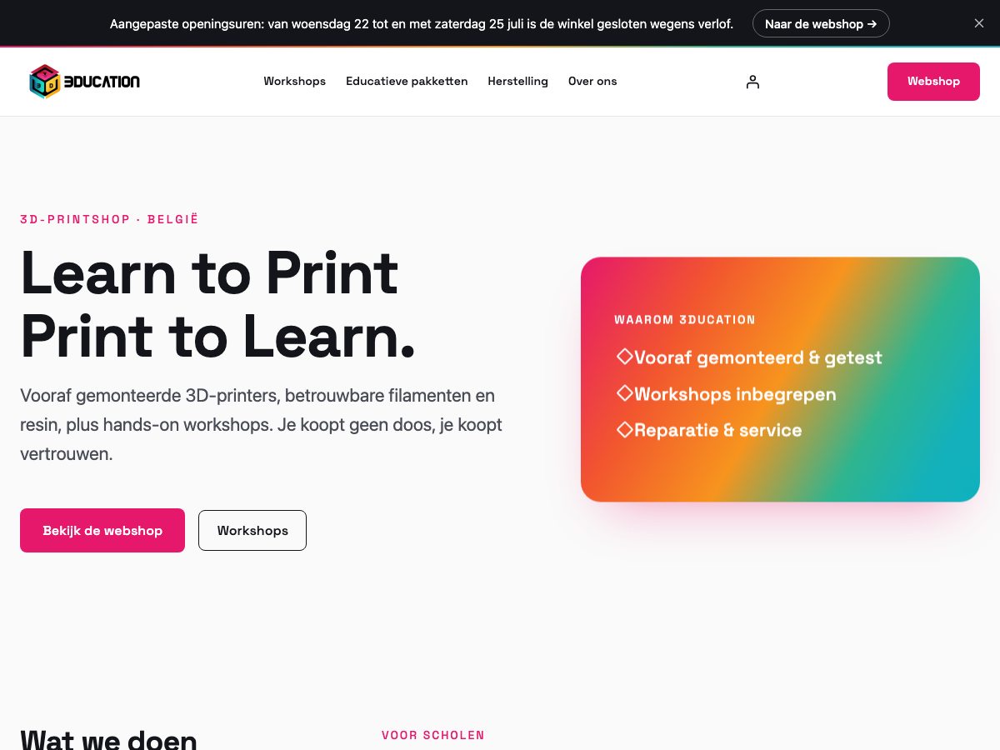

# 3ducation

Custom WooCommerce **block theme (Full Site Editing)** for [3ducation.be](https://3ducation.be), a Belgian 3D-printing shop selling printers, filament, resin, accessories, and hands-on workshops.



## Highlights

- **Block theme / FSE** — design system in `theme.json`, HTML block templates, PHP block patterns. No build step.
- **Brand design system** — tricolor palette and a multi-stop "cube" gradient, self-hosted Space Grotesk display font, fluid type and spacing scale.
- **Storefront** — homepage brochure that funnels to a single Webshop, a storefront-style shop archive with a category bento, single-product, cart, and checkout templates.
- **Dismissible site notice** — an announcement bar for special opening or closing days, fully editable from the WordPress admin (no code).
- **Dutch localization** throughout (nl_NL, EUR, BE).

## Tech stack

- WordPress block theme (`theme.json` v3)
- WooCommerce (blocks)
- [`@wordpress/env`](https://developer.wordpress.org/block-editor/reference-guides/packages/packages-env/) for local development (Docker)

## Local development

Requires Docker (or OrbStack) and Node. **Use Node 22 LTS** — newer Node versions break `wp-env`'s native install step.

```bash
nvm use 22
npm install
npx wp-env start
```

- Site: http://localhost:8888
- Admin: http://localhost:8888/wp-admin  (`admin` / `password`)

Stop with `npx wp-env stop`.

> Tip: the WordPress Site Editor canvas can fail to render in some Chrome builds (blank iframe). Edit in Safari, or edit the theme files directly.

## Site notice (announcement bar)

Edit under **Settings → Site melding** in wp-admin:

- toggle on/off
- message text, optional button label + link
- optional **start/end dates** so the bar auto-appears and auto-expires

Dismissals are remembered per announcement; editing the message re-shows the bar to everyone who dismissed the previous one.

## Structure

```
theme.json            Design system (colors, gradient, fonts, spacing, layout)
style.css             Theme header
functions.php         Theme supports, asset enqueue, site-notice + admin screen
assets/
  custom.css          Supplementary styles theme.json can't express
  notice.js           Site-notice banner behavior
  fonts/              Self-hosted Space Grotesk (woff2)
templates/            Block templates (front-page, archive-product, single-product, cart, checkout, …)
parts/                header.html, footer.html
patterns/             hero, offering, partners, product-categories, webshop-cta, …
```

## Deployment (EasyHost Managed WordPress)

The live site runs on EasyHost Managed WordPress. Deploy the theme by SFTP into
`wp-content/themes/3ducation/` (or zip it and upload via **Appearance → Themes → Add New**),
then activate it. Install and configure WooCommerce on the live site, and pick a payment
gateway (e.g. Mollie). Content (products, pages) is entered on the live site; it does not travel with the theme.
